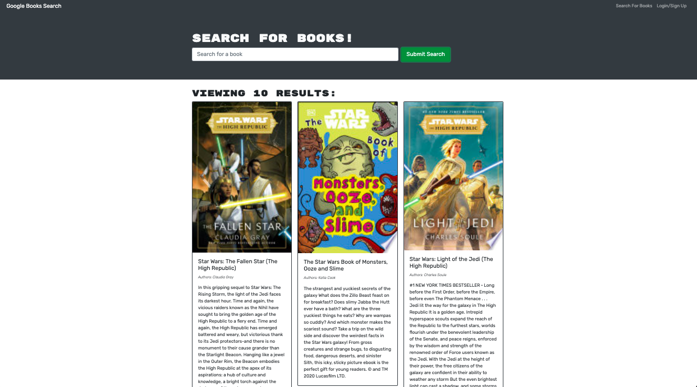
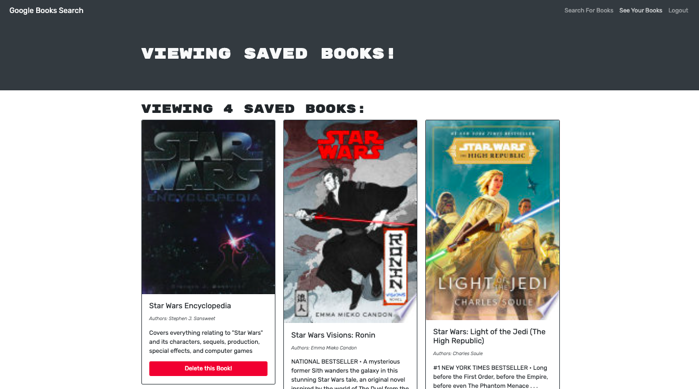

# Book Search Engine
  
  ## Description
  This app allows the user to search for books, and if logged in save books to their profile by using React, React Router, MongoDB, Apollo Server, and Apollo Client, along with other dependencies.

 ## GitHub Repository:

  https://github.com/jillsuarez/book-search-engine
  ## Table of Contents
  * [Installation](#installation)
  * [Usage](#usage)
 
  ## Installation
  In the root folder run npm i to install all dependencies. 
  ## Usage
  For full functionality, sign up, login, search books, save books you'd like to read.
  
 
 
  
  ## GitHub Profile:
  
  https://github.com/jillsuarez

